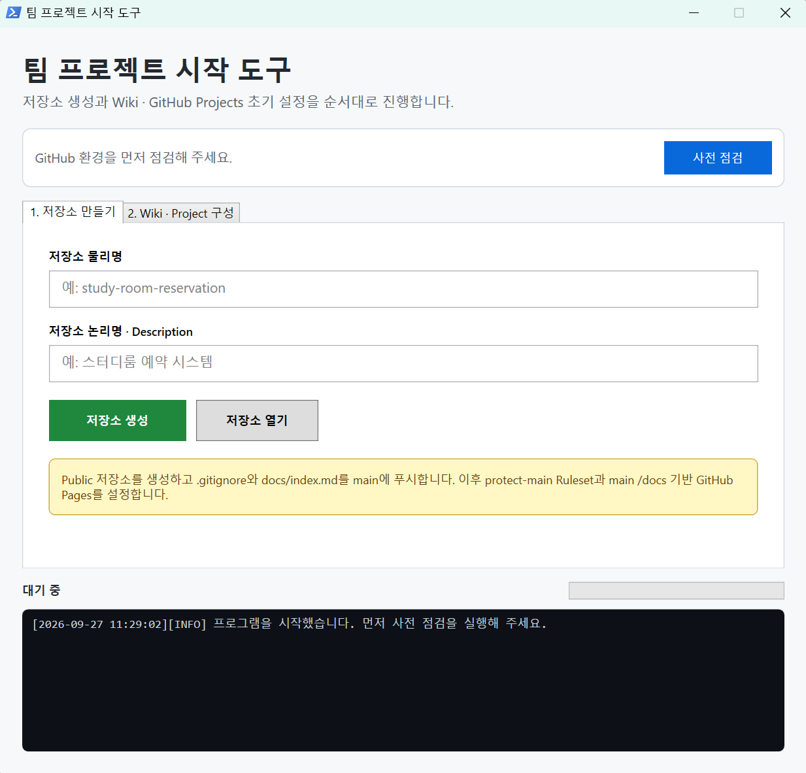
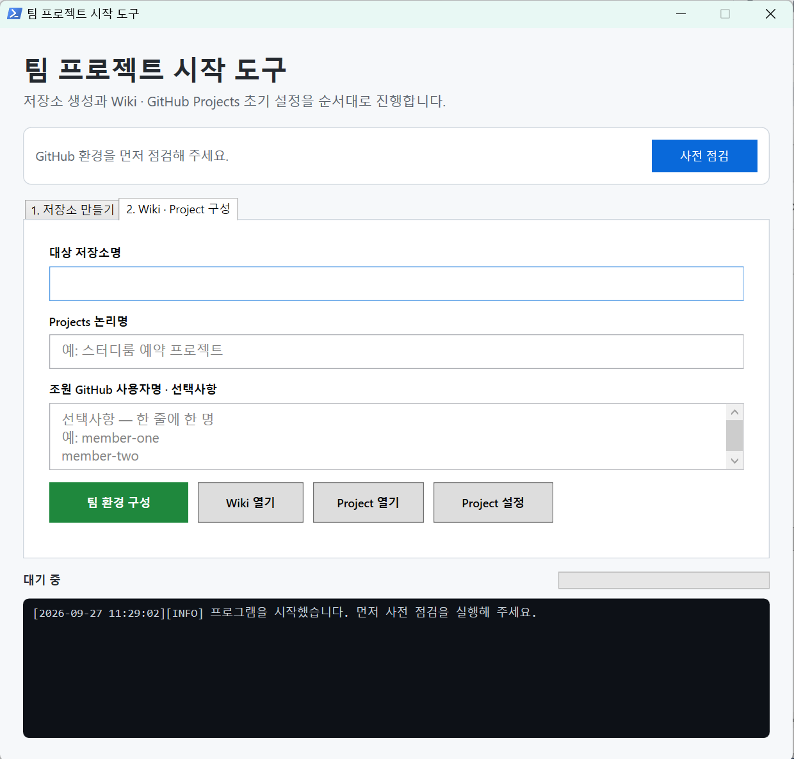

# 팀 프로젝트 시작 도구

Windows에서 GitHub 팀 프로젝트의 초기 구성을 GUI로 자동화하는 도구입니다.

## 지원 환경과 조건

- Windows 10 또는 Windows 11
- Windows PowerShell 5.1과 WPF
- Git for Windows
- 최신 GitHub CLI(`gh`)
- Spring Boot 초기화 기능 사용 시 `start.spring.io`에 연결할 수 있는 인터넷 환경
- GitHub 개인 계정
  - 현재 버전은 개인 계정 소유 저장소와 Project만 지원합니다.
  - Organization 소유 저장소와 Project는 지원하지 않습니다.
- Public 저장소, GitHub Projects, Rulesets 및 GitHub Pages를 생성·수정할 수 있는 계정 권한

프로그램은 실행할 때 `gh`에 로그인된 활성 계정을 조회합니다. 사용자명, 사용자 ID 및 인증 토큰은 소스 코드에 고정되어 있지 않습니다.

## 최초 준비

PowerShell 또는 터미널에서 다음 명령으로 Git과 GitHub CLI 설치 여부를 확인합니다.

```powershell
git --version
gh --version
```

사용할 개인 GitHub 계정으로 로그인하고 저장소 및 Project 권한을 허용합니다.

```powershell
gh auth login
gh auth refresh -s repo -s project
gh auth status
```

Git을 처음 사용하는 컴퓨터라면 GitHub CLI 인증을 Git에서도 사용할 수 있도록 다음 명령을 한 번 실행합니다.

```powershell
gh auth setup-git
```

## 실행 절차

1. 이 저장소를 내려받거나 압축 파일을 풀고 폴더 구조를 유지합니다.
2. `팀프로젝트-시작.vbs`를 더블클릭합니다. 터미널 창 없이 GUI가 열립니다.
3. **사전 점검**을 눌러 Git, GitHub CLI, 활성 로그인 계정, Project 접근 권한과 템플릿 파일을 확인합니다.
4. **1. 저장소 만들기**에서 저장소 물리명과 논리명을 입력합니다. 기초 Spring 프로젝트가 필요하면 **Spring Boot 기초 프로젝트 초기화**를 선택하고 자동 입력된 Metadata를 확인한 뒤 저장소를 생성합니다.

   

5. 생성된 GitHub 저장소의 Wiki에서 `Home` 페이지를 한 번 수동 생성합니다.
6. **2. Wiki · Project 구성**에서 대상 저장소명, Project 논리명과 선택적인 조원 계정을 입력해 팀 환경을 구성합니다.

   

7. 필요한 경우 **Project 설정**을 눌러 `Default repository`를 생성한 저장소로 수동 지정합니다.

## 1단계: 저장소 만들기

다음을 자동으로 수행합니다.

- Public 저장소 생성
- 고정 `.gitignore`, `README.md`, `docs/index.md`와 설계 문서 6개 커밋
- 선택 시 Spring Initializr 기반 기초 프로젝트 생성
  - Project: Gradle - Groovy
  - Language: Java
  - Spring Boot: 4.1.1
  - Packaging: Jar
  - Configuration: YAML
  - Java: 21
  - Dependencies: Spring Web, Mustache, Lombok, Spring Boot DevTools
  - Spring Data JPA와 MySQL은 MySQL 기능 구현 전까지 제외
  - 기본 활성 프로필: `dev`
  - `application-dev.yaml`: 포트 8080, 루트 INFO, 프로젝트 Package DEBUG
  - `application-prod.yaml`: 포트 5000
- Spring Metadata 자동 입력
  - Group: `fullstack.teamproject`
  - Artifact: 저장소 물리명에서 하이픈, 밑줄 등 구분 문자를 제거한 소문자 이름
  - Package: `fullstack.teamproject.{artifact}`
- `main` 브랜치 푸시
- `protect-main` Ruleset 생성
  - Active
  - 현재 로그인한 본인만 항상 우회 가능
  - PR 필수
  - 승인 1명 필수
  - 새 커밋 시 기존 승인 초기화
  - Force push 차단
- GitHub Pages를 `main` 브랜치의 `/docs`로 설정

생성되는 `README.md`는 `docs/index.md`만 연결하고, 문서 목차에서 다음 설계 문서로 이동하는 2단계 구조를 사용합니다.

```text
README.md
└─ docs/index.md
   ├─ requirements.md
   ├─ business-rules.md
   ├─ database-design.md
   ├─ screen-design.md
   ├─ api-design.md
   └─ convention.md
```

설계 문서는 제목과 작성 안내만 들어 있는 초기 상태로 만들어집니다. 프로젝트별 내용은 생성 후 팀의 설계 과정에서 채웁니다. Initializr가 생성한 `.gitignore`는 사용하지 않고 프로그램 폴더의 고정 `.gitignore` 템플릿으로 항상 덮어씁니다.

1단계가 끝나면 GitHub 저장소의 Wiki에서 임시 `Home` 페이지를 한 번 수동 생성해야 합니다. 이 과정이 없으면 Wiki Git 저장소가 만들어지지 않아 2단계를 진행할 수 없습니다.

## 2단계: Wiki · Project 구성

다음을 자동으로 수행합니다.

- `wiki` 폴더 최상위의 모든 Markdown 파일과 `wiki/images` 이미지를 Wiki에 푸시 (`Home.md` 포함, Markdown 1개 이상)
- 수동 초기화용 Home을 템플릿 `Home.md`로 교체
- Public GitHub Project 생성 또는 동일 제목의 기존 Project 재사용
- Project의 기존 연결 저장소를 정리하고 현재 입력한 저장소만 연결
- Status를 `Todo / In Progress / Done`으로 정리
- 라벨을 `설계 / 기능구현 / 테스트`로 정리
- `시작일`, `완료(예정)일` 날짜 필드 생성
- 기본 보기를 제거하고 다음 보기만 생성
  - `작업 보드`
  - `작업 목록` (`-status:Done`, 시작일 → 완료(예정)일 오름차순 정렬)
  - `프로젝트 일정` (Roadmap 보기 생성 및 이름 설정만 수행)

조원 입력은 선택사항입니다. 비워두면 저장소 및 Project 초대를 건너뜁니다. 입력한 경우 저장소와 Project에 WRITE 권한을 설정합니다.

Project 연결은 자동으로 처리되지만 `Default repository`는 자동 지정하지 않습니다. `Project 설정` 버튼은 마지막으로 구성한 Project의 Settings 페이지를 열어 줍니다. 여기에서 `Default repository`를 대상 저장소 물리명으로 직접 선택합니다.

2단계는 대상 저장소의 기존 라벨과 Project의 기존 보기 및 Status 선택지를 지정된 구성으로 교체합니다. 이미 사용 중인 저장소나 Project에 실행할 때는 기존 설정이 삭제될 수 있으므로 먼저 내용을 확인하세요.

## 다른 계정과 컴퓨터에서 사용

다른 Windows 컴퓨터에서도 위의 지원 조건을 충족하고 해당 사용자의 개인 GitHub 계정으로 `gh auth login`을 완료하면 동일하게 실행할 수 있습니다. 저장소 소유자, Ruleset 우회 사용자, Git 커밋 작성자와 Project 소유자는 현재 활성 로그인 계정으로 자동 결정됩니다.

한 컴퓨터에서 여러 GitHub 계정을 사용하는 경우 실행 전에 다음 명령으로 활성 계정을 확인하세요.

```powershell
gh auth status --active --hostname github.com
```

조직 계정 지원, Project의 `Default repository` 자동 지정, Wiki 최초 생성 자동화, MySQL 및 Flutter 초기화는 현재 범위에 포함되지 않습니다.

## 로컬 데이터와 개인정보

프로그램은 인증 토큰을 직접 저장하지 않으며 GitHub CLI의 인증 정보를 사용합니다. 실행 중 다음 로컬 데이터가 생성됩니다.

- `state.json`: 활성 GitHub 계정명, 최근 저장소와 Project 주소
- `logs/`: 실행 명령, GitHub 계정명, 저장소명, Project 정보와 로컬 임시 경로

두 항목은 `.gitignore`에 등록되어 Git 커밋 대상에서 제외됩니다. 문제 보고를 위해 로그를 공유할 때는 계정명, 조원명, 저장소명과 로컬 경로가 포함되어 있지 않은지 먼저 확인하세요.

## 파일

```text
team-project-starter/
├─ 팀프로젝트-시작.vbs       GUI 실행 파일
├─ TeamProjectStarter.ps1    프로그램 본체
├─ .gitignore                새 저장소용 고정 템플릿
├─ wiki/                     Wiki 템플릿(최상위 Markdown 파일과 images 폴더)
├─ docs/images/              README 실행 화면 이미지
├─ logs/                     날짜별 실행 로그(실행 후 생성, Git 제외)
└─ state.json                마지막 실행 결과(실행 후 생성, Git 제외)
```

`state.json`과 `logs/`는 이 프로그램 저장소의 Git 커밋 대상에서 제외됩니다. 새로 만드는 GitHub 저장소에는 프로그램 폴더의 실행 기록이 복사되지 않습니다.
