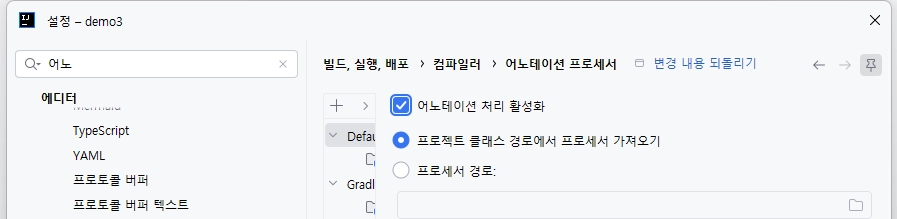
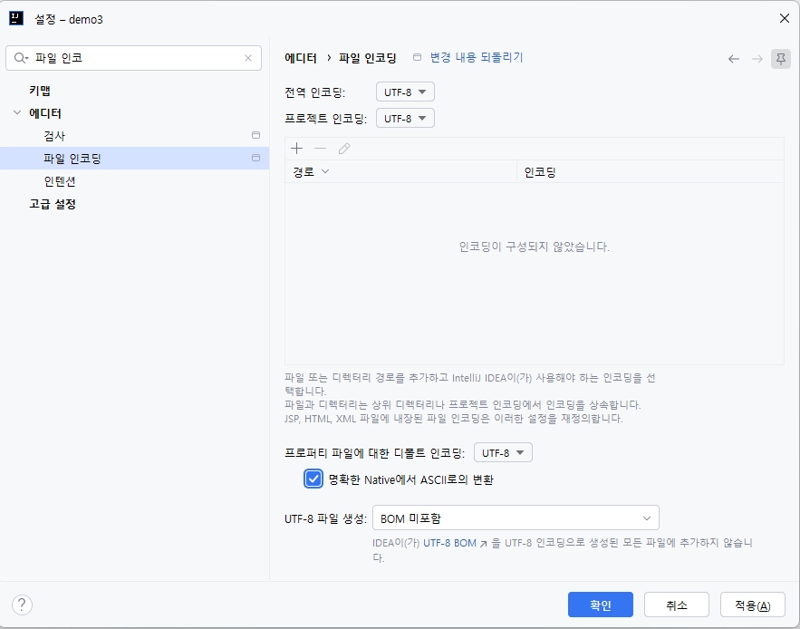
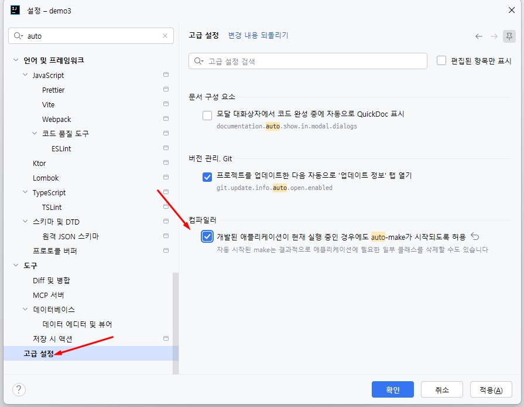
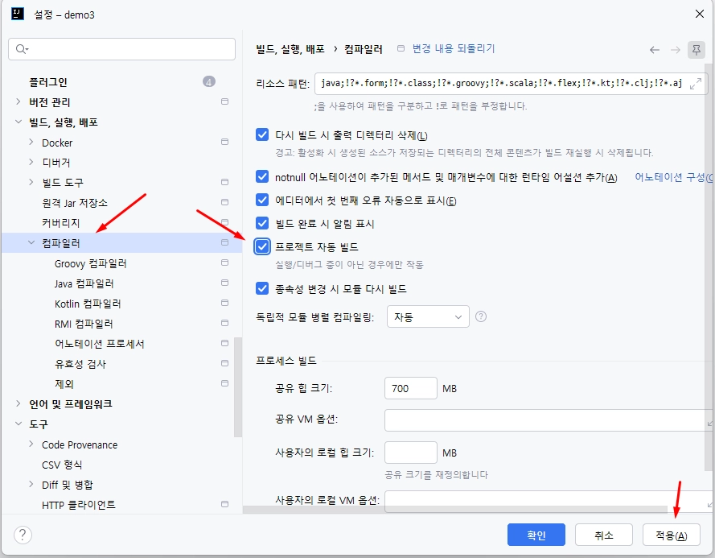
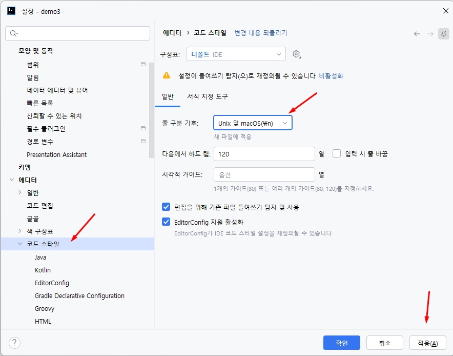

# 최초 개발 절차

팀 프로젝트의 방향을 함께 정하고 설계와 공통 개발을 마친 뒤, 각자 맡은 기능 개발을 시작하기 위한 절차입니다.

[[Home]] · [[GitHub Projects 도입]] · [[작업 순서]]

## 1. 프로젝트 컨셉 정하기

팀원들과 다음 이름을 먼저 확정합니다.

- 프로젝트 논리명: 사람이 읽고 이해하기 쉬운 한글 이름
- 프로젝트 물리명: 저장소와 소스에서 사용할 영문 이름

## 2. GitHub 저장소와 Project 준비

팀 프로젝트 시작 도구로 저장소와 GitHub Project를 만들고 팀원을 초대합니다.

- 저장소, Wiki, Project가 모두 열리는지 확인합니다.
- 팀원에게 저장소와 Project의 WRITE 권한이 있는지 확인합니다.
- 이 Wiki를 이용해 Issue, 브랜치, Pull Request 사용법을 함께 실습합니다.
- [[일일 리포트]] 문서에 따라 Discussions 카테고리와 첫 게시글을 준비합니다.

## 3. 개발 절차 소개

개발에 들어가기 전에 다음 원칙을 팀원 모두에게 알립니다.

- GitHub Project와 Issue를 이용해 작업을 관리합니다.
- 필요한 설계를 먼저 끝낸 뒤 기능 개발을 시작합니다.
- 공통 개발을 완료한 뒤 각자 담당한 기능을 개발합니다.

자세한 협업 순서는 [[작업 순서]] 문서를 참고합니다.

## 4. 설계

프로젝트에 필요한 설계만 선택해 진행합니다. 먼저 설계 작업을 위한 Issue를 만들고, 저장소의 `docs/index.md`에서 각 문서로 이동해 내용을 작성합니다.

- 요구사항
- 사용자 시나리오 및 업무 규칙
- 데이터베이스 설계서 및 ERD
- 화면 설계서
- REST API 설계서
- 코드 컨벤션

## 5. 업무 분담

공통 개발이 끝나면 실제 구현에 필요한 작업 목록을 정리합니다.

- 기능별 Issue를 만듭니다.
- 각 Issue에 구현 요구사항, 작업 대상 파일, 테스트 범위와 방법을 자세히 적습니다.
- 담당자를 지정합니다.
- Project의 로드맵 보기에서 시작일과 완료 예정일을 정리합니다.

마지막으로 준비에 참여한 팀원들에게 감사를 전하고, 다음 개발일부터 각자 맡은 Issue를 기준으로 작업을 시작합니다.

## 6. Spring Boot 프로젝트 Clone 후 IntelliJ IDEA 설정

프로젝트를 Clone하고 IntelliJ IDEA로 연 뒤 다음 화면을 순서대로 확인합니다.

### 1. 어노테이션 처리 활성화



### 2. 파일과 프로젝트 인코딩을 UTF-8로 설정



### 3. 애플리케이션 실행 중 자동 Make 허용



### 4. 프로젝트 자동 빌드 활성화



### 5. 줄 구분 기호를 Unix 및 macOS(LF)로 설정



설정을 변경한 뒤 `적용`과 `확인`을 누르고 Spring Boot 프로젝트를 실행합니다.

## 7. 실행 환경과 설정

- 모든 팀원이 Clone한 프로젝트를 같은 Java 버전으로 실행합니다.
- `application-local.yaml`과 `application-dev.yaml`의 역할을 확인합니다.
- 데이터베이스 URL, 사용자명, 비밀번호 등 실행에 필요한 값을 환경변수로 분리합니다.
- 실제 비밀번호나 비밀값은 Git에 커밋하지 않습니다.
- `.env.example`에는 필요한 환경변수명과 가짜 예시값만 작성합니다.
- README에 환경변수 설정, 애플리케이션 실행과 테스트 명령을 기록합니다.

### 환경변수와 `.env` 설정

별도 설정 없이 실행하면 `local` 프로필과 H2 메모리 데이터베이스를 사용합니다. MySQL로 개발할 때는 프로젝트를 만들 때 자동 생성된 `.env.example`을 `.env`로 복사하고 사용자명과 비밀번호를 자신의 환경에 맞게 변경합니다. `.env.example`은 다음 형식이며 DB URL의 데이터베이스명은 프로젝트 생성 시 입력한 값으로 자동 작성됩니다.

```properties
SPRING_PROFILES_ACTIVE=dev
DEV_DB_URL=jdbc:mysql://localhost:3306/project_db?serverTimezone=Asia/Seoul
DEV_DB_USERNAME=your_username
DEV_DB_PASSWORD=your_password
```

- `SPRING_PROFILES_ACTIVE`를 생략하면 기본값 `local`로 H2를 사용하고, `dev`로 설정하면 MySQL을 사용합니다.
- `project_db`는 팀에서 정한 MySQL 데이터베이스명으로 변경합니다.
- `DEV_DB_URL`을 생략하면 프로그램이 생성한 기본 localhost URL을 사용합니다.
- `DEV_DB_USERNAME`과 `DEV_DB_PASSWORD`에는 기본값이 없으므로 반드시 설정합니다.
- `.env`에는 실제 접속 정보가 들어가므로 절대 커밋하지 않습니다.
- 공유가 필요하면 실제 값 대신 가짜 예시값만 작성한 `.env.example`을 커밋합니다.

> ⚠️ 주의: 실제 URL, 사용자명, 비밀번호가 들어 있는 `.env`는 절대로 `git add`하거나 커밋하지 않습니다. 커밋 전에 `git status`로 포함 여부를 다시 확인합니다.

새 팀원이 이 문서와 `.env.example`만 보고 자신의 환경변수를 준비하고 프로젝트를 실행할 수 있는 상태까지 확인합니다.
